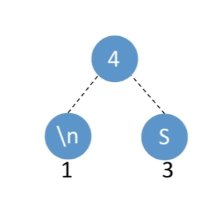
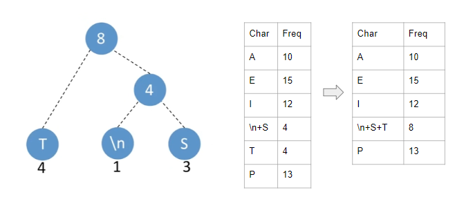
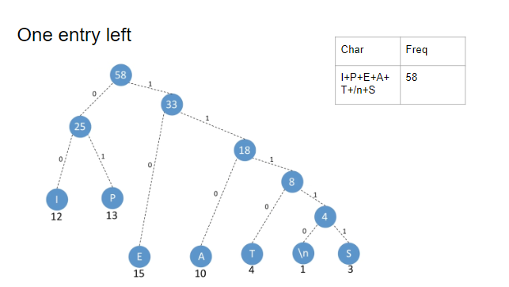

# How It Works
{: .fs-9 }

The algorithm takes an input file and converts it into a compressed binary file.
{: .fs-6 .fw-300 }

It is a greedy algorithm that tries to map more frequent characters with a smaller number of bits and less frequent characters with a larger number of bits.

Below is a mapping we would want to achieve:

| Char | Code  | Freq | Total Bits |
| ---- | ----- | ---- | ---------- |
| A    | 110   | 10   | 30         |
| E    | 10    | 15   | 30         |
| I    | 00    | 12   | 24         |
| S    | 11111 | 3    | 15         |
| T    | 1110  | 4    | 16         |
| P    | 01    | 13   | 26         |
| \n   | 11110 | 1    | 5          |

To do this we want the encoding scheme to be a min heap (binary tree where parent node value is always greater than child node value).

Each node represents a frequency.

Every time we traverse left in the tree, we append a 0 bit, everytime we traverse right, we append a 1 bit


First create a table mapping characters to its frequency

| Char | Freq |
| ---- | ---- |
| A    | 10   |
| E    | 15   |
| I    | 12   |
| S    | 3    |
| T    | 4    |
| P    | 13   |
| \n   | 1    |

Then take the two lowest frequencies and make them the children of a parent node whose value is the sum of its children.



Continuing...



Until one entry left



Traverse the tree and get the codes then encode the text

**Text:**

```md
ASSSAAAAEEEEEEEEEEEEEEEIIIIIIIIIIIIAAAAATTTTPPPPPPPPPPPPP\n
```

**Bits:**

```md
11011111111111111111011011011010101010101010101010101010101000000000000000000000000011011011011011011101110111011100101010101010101010101010111110
```

***Result***

<dl>
<dt>original bit length</dt>
<dd>464 (58 * 8)</dd>
<dt>encoded bit length</dt>
<dd>146</dd>
</dl>
