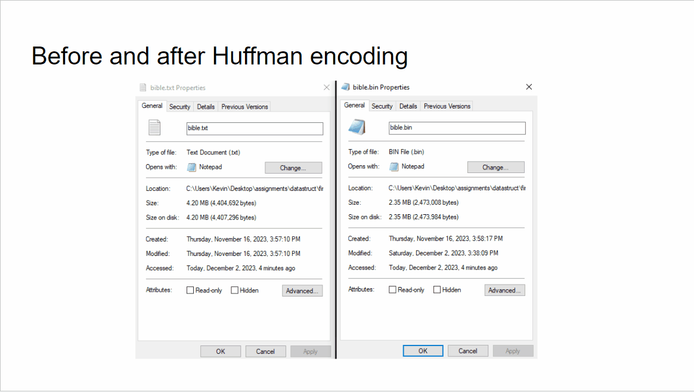

# <a href="https://github.com/bloopgoop/huffman" target="_blank">Huffman Algorithm</a>
{: .fs-9 }

Implementation of a [Huffman code](https://en.wikipedia.org/wiki/Huffman_coding), which is a lossless data compression technique. It utilizes a frequency-sorted binary tree.
{: .fs-6 .fw-300 }

{:toc}
