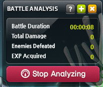

# Computer Vision
{: .fs-9 }

The program captures a portion of the screen called the "battle analysis" and uses an [Optical Character Recognition](https://en.wikipedia.org/wiki/Optical_character_recognition) tool to read the "Enemies Defeated" section. The "Enemies Defeated" will serve as a metric to see how well the bot is doing. The program will also simultaneously capture the minimap and record the chararcter's position to track its state.

Libraries like cv2, mss, and numpy helped to detect, screenshot, and manipulate images for processing. After processing, I created an OCR using a convolutional neural network with a custom data set to read and extract numbers from the battle analysis.