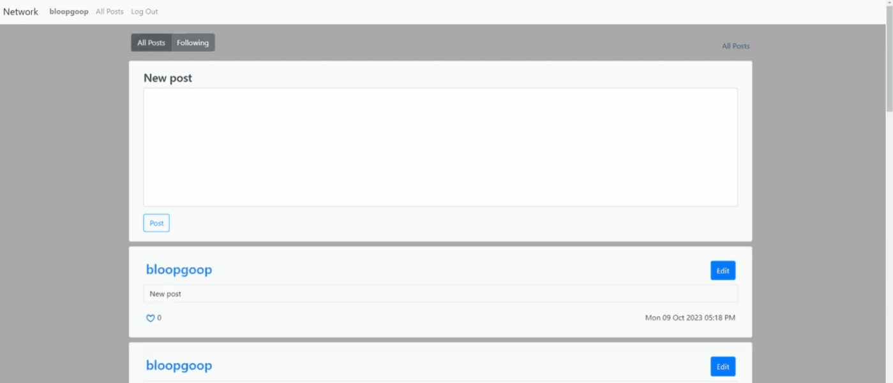

# <a href="https://github.com/bloopgoop/network" target="_blank">Network</a>
{: .fs-9 }

Full stack web application inspired by Twitter and Harvard's CS50W network project.
{: .fs-6 .fw-300 }

<a href="https://www.youtube.com/watch?v=nZ8m0qvMUxQ" target="_blank">Video Demo</a>

{:toc}
